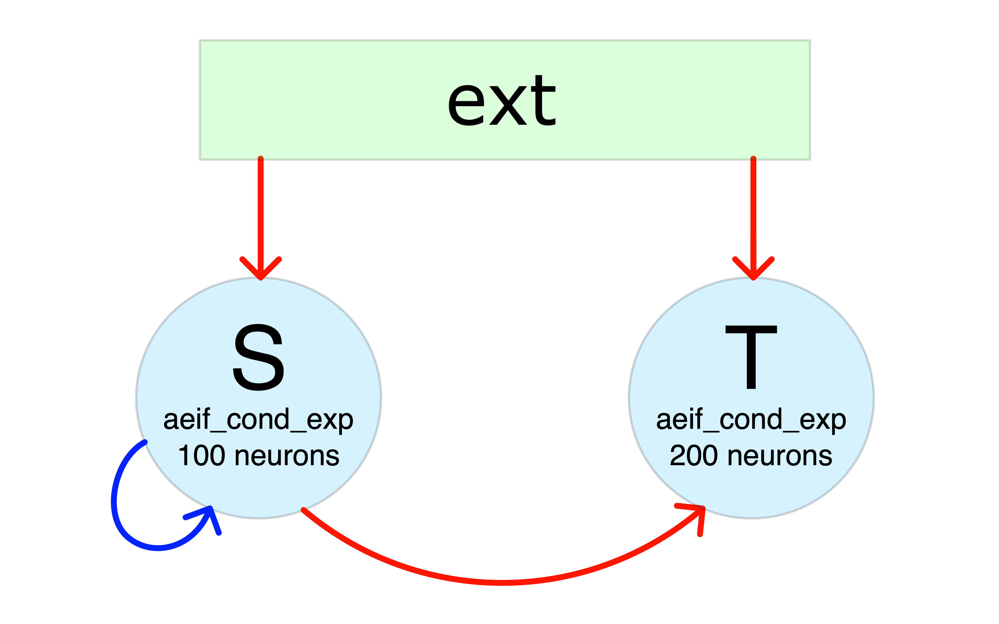
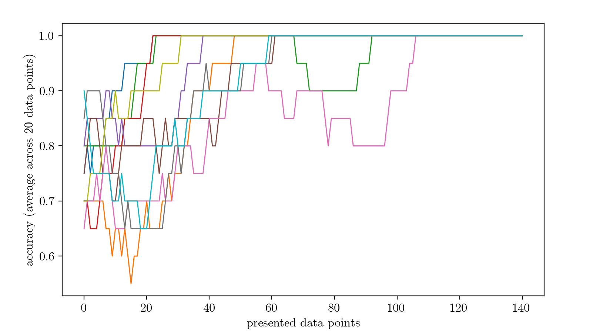

.. _examples:

Examples
========

This page demonstrates two examples of how the implemented code can be used:

- :ref:`Simulation of SNN`: a network consisting of two populations of adaptive LIF neurons is simulated for a duration of 10 seconds.
- :ref:`Training of SNN`: a three-layer spiking neural network (SNN) with LIF neurons is trained to solve the XOR problem.

The configuration files required to run these examples are provided in the ``src/build`` and ``src/build/example`` directories.

.. _Simulation of SNN:

Simulation of SNN
-----------------

In this example we simulate the network illustrated in the figure below, where red arrows represent excitatory projections and blue arrows indicate inhibitory connections:

To build this network, the necesary configuration files are:

- ``subnets_config_yaml``: specify network composition and features of the neurons in each SubNetwork:

  .. literalinclude:: ../src/build/example/NoTrain/config.yaml
      :language: yaml

- ``weights_config_yaml``: connection weights (in nS) with the convention that

      * positive weights are excitatory
      * negative weights are inhibitory

  .. literalinclude:: ../src/build/example/NoTrain/config_weights.yaml
      :language: yaml

- ``connections_config_yaml``: connectivity probabilities between subnetworks and corresponding delays (in ms)

  .. literalinclude:: ../src/build/example/NoTrain/config_connections.yaml
      :language: yaml

- ``to_save_config_yaml``: list of neurons whose state you want to save at each step

  .. literalinclude:: ../src/build/example/NoTrain/config_to_save.yaml
      :language: yaml

Simulation configuration and execution
^^^^^^^^^^^^^^^^^^^^^^^^^^^^^^^^^^^^^^
Once the Network is configured you can set the simulation control variables in a yaml file ``<sim-name>.yaml`` (e.g., example.yaml in src/build/example/NoTrain):

  .. literalinclude:: ../src/build/example/NoTrain/example.yaml
      :language: yaml

.. note:: - the variable ``n_step`` can be used to execute the simulation in more than one step. This is useful for issues related to memory consumption (in case of long simulations with many neurons increase the value of n_step for better performance)
        - the ``example/NoTrain/sim`` output directory is automatically created

And finally run the simulation using (from the build directory):

         $ ./main example/NoTrain/example.yaml

Output of the simulation
^^^^^^^^^^^^^^^^^^^^^^^^

After the simulation has finished, you will find the following files in the output directory:

- a copy of the configuration files used for the simulation
- some files containing the spiking times of the neurons separately for each SubNetwork and with format::

    <neuron-index> <list-of-spike-times>

- a directory ``neuron_states`` containing:

  * a file ``t.txt`` containing the time steps of the simulation
  * a file ``<SubNetwork-name>_<neuron-index>.txt`` for each neuron indicated in ``to_save_config_yaml`` containing the state ``x`` of the neuron at each time step

  .. note:: if no neuron is indicated in ``to_save_config_yaml``, the ``neuron_states`` directory will not be produced

Basic analysis of the results
^^^^^^^^^^^^^^^^^^^^^^^^^^^^^

Using the code below (in the build directory):

.. literalinclude:: ../src/build/analysis.py
  :language: python

you can easily visualize the results of the simulation.

.. _Training of SNN:

Training of SNN
---------------

In this example we solve the XOR problem employing a SNN of LIF neurons with exponential synapses. The XOR problem is a classic problem in artificial neural network research which consists into training a neural network to predict the outputs of XOR logic gates given two binary inputs.
A XOR function returns true when the inputs are different and false when they are the same:

=====  =====  =======
A      B      A XOR B
=====  =====  =======
False  False  False
True   False  True
False  True   True
True   True   False
=====  =====  =======

To do so, we employ a three layer architecture:

- ``L1``: input layer (2 neurons, associated with inputs A and B respectively)
- ``L2``: hidden layer (8 neurons)
- ``L3``: output layer (2 neurons, associated with the labels True and False respectively)

To encode the input values A and B we set a high input current (50 pA) for True and low input current (30  pA) for False, independently for the two neurons in ``L1``.
For demonstration purposes, we set the configuration files to train all weights from L1 to L2, and from L2 to L3, as well as the input baseline currents of L2.

To setup the described architecture we employ the following configuration files:

- ``subnets_config_yaml``: specify network composition and features of the neurons in each SubNetwork:

  .. literalinclude:: ../src/build/example/Train/config1.yaml
      :language: yaml

- ``weights_config_yaml``: connection weights (in nS, positive weights are excitatory):

  .. literalinclude:: ../src/build/example/Train/config_weights1.yaml
      :language: yaml

- ``connections_config_yaml``: connectivity probabilities between subnetworks, corresponding delays (in ms) and path to initialization weights:

  .. literalinclude:: ../src/build/example/Train/config_connections1.yaml
      :language: yaml

- ``to_save_config_yaml``: list of neurons whose state you want to save at each step

  .. literalinclude:: ../src/build/example/Train/config_to_save1.yaml
      :language: yaml

- ``batches_dur_file``: contains the duration of the mini-batches employed during training

    .. literalinclude:: ../src/build/example/Train/batches_dur.txt
        :language: yaml

To handle the training process we employ a python3 script which:

- set up initialization weights and baseline currents (of L2);

- set up the configuration files:

    * ``general_config_yaml``: sets the general configuration variables:

      .. literalinclude:: example/Train/training.yaml
          :language: yaml

    * ``general_config_yaml``: sets the general configuration variable for training:

      .. literalinclude:: example/Train/config_training1.yaml
          :language: yaml

- compute the accuracy

- repeat the training protocol for 10 times.

As shown below, the problem is resolved after only a few data points are presented during training.

.. note:: for simplicity, in this example we processed each input data point individually in separate epochs. This strategy is not raccomended in more complex problems.

The employed code is provided below:

.. literalinclude:: ../src/build/handler.py
    :language: python

Please set up the configuration files ``subnets_config_yaml``, ``weights_config_yaml``, ``connections_config_yaml``, ``to_save_config_yaml``, ``batches_dur_file`` in the output directory ``src/build/example/Train`` and run this code from the ``build`` to replicate the experiment.
